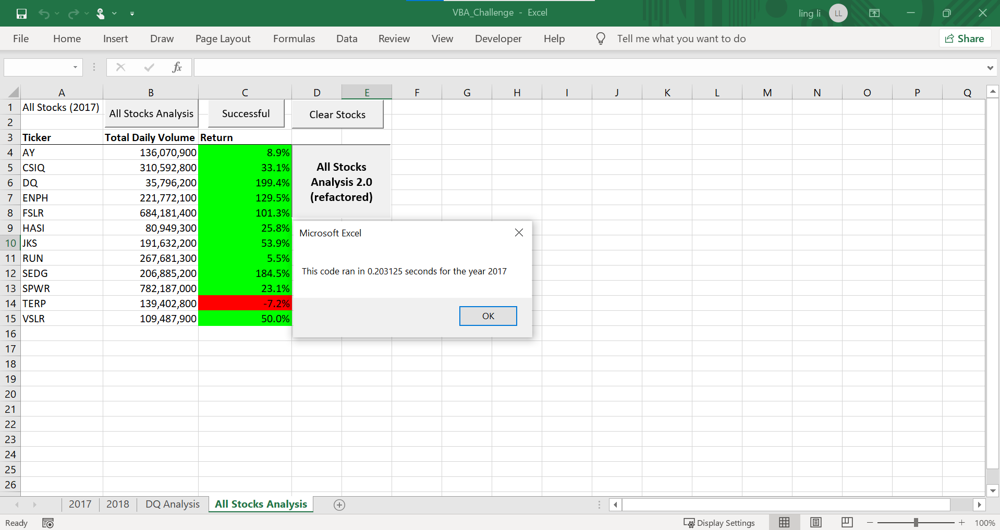
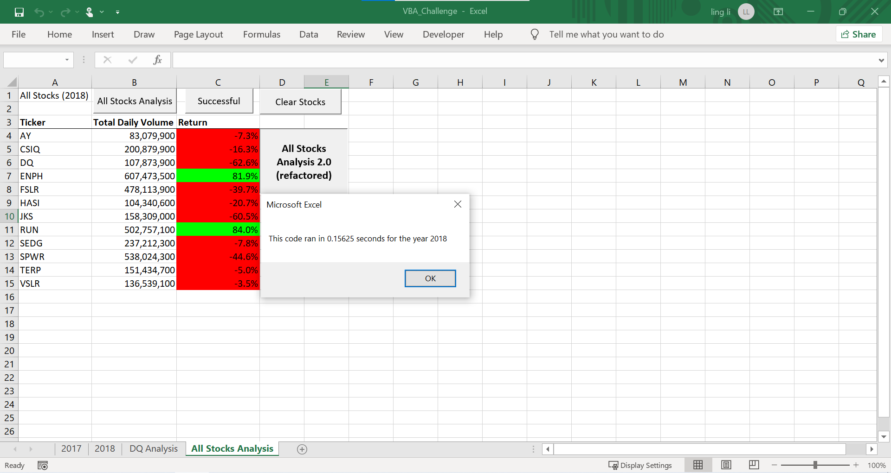

# Stock-Analysis
 Using Visual Basics for Applications (VBA), create macros to automate stock analysis data

## Overview of Project

**Purpose**
The purpose of this analysis was to utilize VBA to code a macro that would automate the process of analyzing different stocks chosen by Steve's parents. Initially, we only analyzed the DQ stock by reading the 2017 and 2018 sheets to extract the closing prices at the start of the year compared to the end of the year. Also, we wanted to find the total volume traded which we assume to be an indicator of the success of the stock. Then, we wanted to apply the same analysis on all of the stocks. Lastly, we wanted to refine our code to run efficiently.   

**Background**
Coding through VBA allows us to create macros that can automate trivial, repetitive tasks in Microsoft Office Excel. By creating macros, we can efficiently screen through data and output information that we can use to make inferences. For example, we can run a quick analysis that will spit out the percent return and total volume in less than one fifth of a second. We used variables with different data types to fit the values we needed to store, if-then statements, For Loops, comparison operators, indexes to access data within arrays, nested loops, conditional formatting, and numeric formatting to build our macro for Steve. We practiced refactoring our code to improve its runtime. Learning to script streamlined code is similar to revising a written report, it should be concise, simple, and effective in conveying its purpose.

## Analysis

**Results** 

_**Making the code run faster**_
We wanted our code to be capable of reading through the provided data from the years 2017 and 2018. We implemented the command InputBox to allow the user of our macro to type in the year they wanted to analyze. The command allows for a prompt to be given and for the user input to be saved as a variable in the form of a string. We saved the users' input under "yearValue".

We set up our output sheet to have 3 columns; ticker, total volume, and return, that would save our calculated values to their respective stock ticker name. We took advantage of using an array to store the ticker data and accessed the specific stock ticker by its index. Then, VBA was able to readby looping through each row and updating the output columns through the use of if-then statements so long as the ticker value matched the stock ticker we wanted to analyze.

At the beginning of our code, we also used the timer function in VBA to save the start time after getting the user's input year value and at the end of the code, after the calculations were saved in the output sheet. This gave us the total elapsed time so that we could quantify how efficient our code was. 

our completed code looked like this:
    
    Sub AllStocksAnalysis()
    'initialize startTime and endTime
    Dim startTime As Single
    Dim endTime As Single
    
    'activate new sheet all stocks analysis as output sheet
    Worksheets("All Stocks Analysis").Activate
    
    'have user input the year for stock analysis, give prompt and title
    yearValue = InputBox("What year would you like to run the analysis on?", "Year for Stock Analysis")
    
    'start timer function on excel after user inputs year to analyze
    startTime = Timer
    
    'sets value in cell a1 with title
    Range("a1").Value = "All Stocks (" + yearValue + ")"
    'changed "All Stocks (2018)" to "All Stocks(" + yearValue + ")"
    
    'sets the headers in columns A,B,C on row 3
    Cells(3, 1).Value = "Ticker"
    Cells(3, 2).Value = "Total Daily Volume"
    Cells(3, 3).Value = "% Return"
    
    'to run analysis on all stocks, create a program flow that loops through all the tickers
    'obviously we can just copy and paste the code we used for DQ over and over for all tickers
    'but to be more concise and precise with coding its better to be DRY: Don't Repeat Yourself
    'Let us use a For loop and an Array
    
    'Arrays: aka lists
    'they hold an arbitraty number of variables of the same data type
    'each variable has an **index** and the array is named
    'Index: is the position of the variable in the array, start at zero
        'ex:index of 1 is the second position in the array
    'arrays are initialized with the dim keyword too but you need to
    '1. insert a number in parentheses to represent the number of elements
    '2. specify the type of variable for each element in the array
        'ex: Dim tickers(11) as string : Dim arrayName(number of elements) as dataType
 
    Dim tickers(12) As String
    
    'assign each element, total of 12 stocks, sorry no shortcuts here
    tickers(0) = "AY"
    tickers(1) = "CSIQ"
    tickers(2) = "DQ"
    tickers(3) = "ENPH"
    tickers(4) = "FSLR"
    tickers(5) = "HASI"
    tickers(6) = "JKS"
    tickers(7) = "RUN"
    tickers(8) = "SEDG"
    tickers(9) = "SPWR"
    tickers(10) = "TERP"
    tickers(11) = "VSLR"
    
    '2.3.3 Reusing Code
    ' note that you shouldn't initialize variables inside loops as it will confuse VBA
    ' Make a plan
    'Our new macro should do the following:
    '1. Format the output sheet on the "All Stocks Analysis" worksheet. (complete)
    '2. Initialize an array of all tickers. (complete)
    '3. Prepare for the analysis of tickers.
        'Initialize variables for the starting price and ending price.
        Dim startingPrice As Double
        Dim endingPrice As Double
        
        'Activate the data worksheet. changed 2018 to yearValue variable
        Worksheets(yearValue).Activate
        
        'Find the number of rows to loop over.
        RowCount = Cells(Rows.Count, "A").End(xlUp).Row
        
        '4. Loop through the tickers.
        For i = 0 To 11
            ticker = tickers(i)
            totalVolume = 0
        
        '5. Loop through rows in the data. changed 2018 to yearValue variable
            Worksheets(yearValue).Activate
            For j = 2 To RowCount
        
        'Find the total volume for the current ticker.
                If Cells(j, 1).Value = ticker Then
                totalVolume = totalVolume + Cells(j, 8).Value
                End If
        
        'Find the starting price for the current ticker.
                If Cells(j - 1, 1).Value <> ticker And Cells(j, 1).Value = ticker Then
                startingPrice = Cells(j, 6).Value
                End If
        
        'Find the ending price for the current ticker.
                If Cells(j + 1, 1).Value <> ticker And Cells(j, 1).Value = ticker Then
                endingPrice = Cells(j, 6).Value
                End If
    
            Next j
            
         '6. Output the data for the current ticker.
   
            Worksheets("all stocks analysis").Activate
            Cells(4 + i, 1).Value = ticker
            Cells(4 + i, 2).Value = totalVolume
            Cells(4 + i, 3).Value = (endingPrice / startingPrice) - 1
   
        Next i
        
        'end timer function at the end of the analysis
        endTime = Timer
        'show elapsed time in messagebox
        MsgBox "This code ran in " & (endTime - startTime) & " seconds for the year " & (yearValue)
        
        End Sub

These were the results of from our initial code:

As you can see, it took almost 1 second to run the analysis.

While refactoring our code, we realized we could save the calculated values in the form of an array to cut down on run time. By creating a new variable called tickerIndex, we were able to simulataneously loop through the rows and indexes of both the datasheet and save under the same index for our 3 output arrays.

The refactored code looked as follows:

  Sub AllStocksAnalysisRefactored()
    Dim startTime As Single
    Dim endTime  As Single

    yearValue = InputBox("What year would you like to run the analysis on?")

    startTime = Timer
    
    'Format the output sheet on All Stocks Analysis worksheet
    Worksheets("All Stocks Analysis").Activate
    
    Range("A1").Value = "All Stocks (" + yearValue + ")"
    
    'Create a header row
    Cells(3, 1).Value = "Ticker"
    Cells(3, 2).Value = "Total Daily Volume"
    Cells(3, 3).Value = "Return"

    'Initialize array of all tickers
    Dim tickers(12) As String
    
    tickers(0) = "AY"
    tickers(1) = "CSIQ"
    tickers(2) = "DQ"
    tickers(3) = "ENPH"
    tickers(4) = "FSLR"
    tickers(5) = "HASI"
    tickers(6) = "JKS"
    tickers(7) = "RUN"
    tickers(8) = "SEDG"
    tickers(9) = "SPWR"
    tickers(10) = "TERP"
    tickers(11) = "VSLR"
    
    
    'Activate data worksheet
    Worksheets(yearValue).Activate
    
    'Get the number of rows to loop over
    RowCount = Cells(Rows.Count, "A").End(xlUp).Row
    
    '1a) Create a ticker Index
    Dim tickerIndex As Integer
    tickerIndex = 0
    
    '1b) Create three output arrays
    Dim tickerVolumes(12) As Long
    Dim tickerStartingPrices(12) As Single
    Dim tickerEndingPrices(12) As Single
    
    ''2a) Create a for loop to initialize the tickerVolumes to zero.
        For i = 0 To 11
        tickerVolumes(i) = 0
        Next i
        
    ''2b) Loop over all the rows in the spreadsheet.
        For j = 2 To RowCount
    
        '3a) Increase volume for current ticker
            tickerVolumes(tickerIndex) = tickerVolumes(tickerIndex) + Cells(j, 8).Value
            
        
        '3b) Check if the current row is the first row with the selected tickerIndex.
            If Cells(j - 1, 1).Value <> tickers(tickerIndex) Then
            tickerStartingPrices(tickerIndex) = Cells(j, 6).Value
            End If
        
        '3c) check if the current row is the last row with the selected ticker
         'If the next row’s ticker doesn’t match, increase the tickerIndex.
            If Cells(j + 1, 1).Value <> tickers(tickerIndex) Then
            tickerEndingPrices(tickerIndex) = Cells(j, 6).Value
            
            
            '3d Increase the tickerIndex.
            tickerIndex = tickerIndex + 1
            End If
        
    
        Next j
    
    '4) Loop through your arrays to output the Ticker, Total Daily Volume, and Return.
    For i = 0 To 11
        'access cell on that sheet and the specific values to print out
        Worksheets("All Stocks Analysis").Activate
        'tickername
        Cells(4 + i, 1).Value = tickers(i)
        'volume
        Cells(4 + i, 2).Value = tickerVolumes(i)
        'percent return
        Cells(4 + i, 3).Value = (tickerEndingPrices(i) / tickerStartingPrices(i)) - 1
    Next i
    
    'Formatting
    Worksheets("All Stocks Analysis").Activate
    Range("A3:C3").Font.FontStyle = "Bold"
    Range("A3:C3").Borders(xlEdgeBottom).LineStyle = xlContinuous
    Range("B4:B15").NumberFormat = "#,##0"
    Range("C4:C15").NumberFormat = "0.0%"
    Columns("B").AutoFit

    dataRowStart = 4
    dataRowEnd = 15

    For i = dataRowStart To dataRowEnd
        
        If Cells(i, 3) > 0 Then
            
            Cells(i, 3).Interior.Color = vbGreen
            
        Else
        
            Cells(i, 3).Interior.Color = vbRed
            
        End If
        
    Next i
 
    endTime = Timer
    MsgBox "This code ran in " & (endTime - startTime) & " seconds for the year " & (yearValue)
    End Sub

 By using an array to save our data, we were also able to better manage the memory associated with the data saved.
 
 The run times after refactoring were as so:
 
 
 
 
 
 Now the code runs 4 times as fast.

_**What stocks should Steve's Parents invest in?**_
In regards to which stocks were favorable for investing, we can see that between 2017 and 2018, only two stocks look consistently successful. They are ENPH and RUN because both have a high percent of return in both years and their trading volumes doubled in just one year.

**Summary**

_What are the advantages or disadvantages of refactoring code?_

The advantage of refactoring aids in making the code more efficient and concise to better perform its intended task. Simplifying your code helps in maintenance and readability as well. However, a disadvantage could be the additional time needed to refine it. This could land you in a world of confusion as you try to adjust the pattern and order. Refactoring should be done with care because rewriting variables and adjusting the order of commands could break what was once usable code.

_How do these pros and cons apply to refactoring the original VBA script?_

When renaming variables and distinguishing which variables are used in what order, I found it very difficult to keep track of what was happening. Overthinking lead me to assume more ways to adjust the code and along the way, the more changes I made, the more confused I was as to how everything related to the initial code I had written. I found myself forgetting that I was saving my data in the form of an array and not a double datatype. This required me to make sure I incorporated the tickerIndex variable in its appropriate moment. I began mixing the syntax together and broke my code. I learned its important to have loops ended before starting new ones so that one did not accidentally influence the next. 

